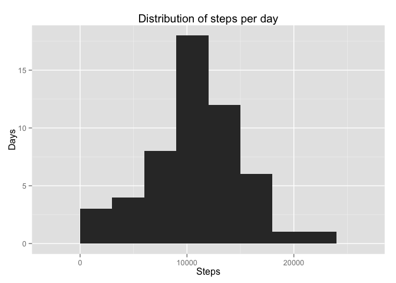
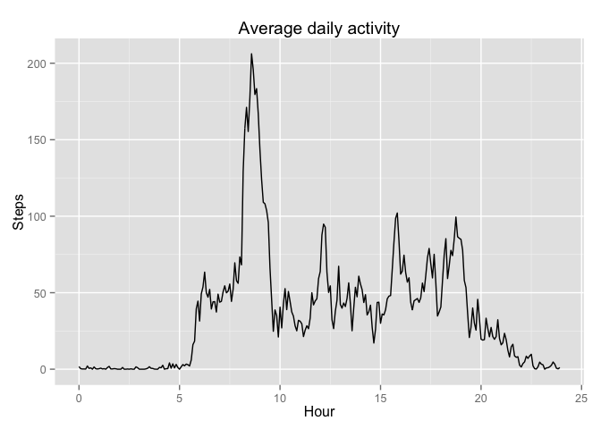
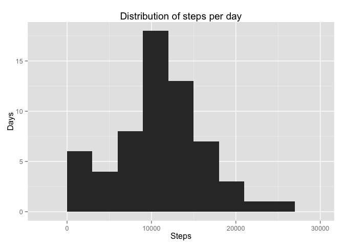
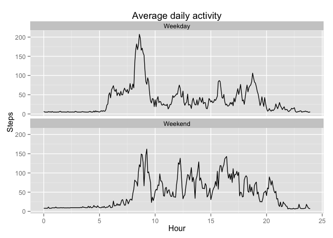

# Reproducible Research: Peer Assessment 1


```r
# Basic dependencies
library(ggplot2)
```

## Loading and preprocessing the data

First, read the activity data from the `activity.zip` file.


```r
activity <- read.csv(unz("activity.zip", "activity.csv"));
tail(activity)
```

```
##       steps       date interval
## 17563    NA 2012-11-30     2330
## 17564    NA 2012-11-30     2335
## 17565    NA 2012-11-30     2340
## 17566    NA 2012-11-30     2345
## 17567    NA 2012-11-30     2350
## 17568    NA 2012-11-30     2355
```

The interval is actually the 24-hour clock. It may be convenient on plots to represent the interval as a real number, for that purpose, we can use the following function that converts the intervals to the hour plus a fraction of the hour:

```r
interval_as_hour <- function(interval) {
  return((interval %/% 100) + (interval %% 100) / 60)
}
```

## What is mean total number of steps taken per day?

First, aggregate the steps taken per day. Missing data is ignored.

```r
steps_by_date <- aggregate(steps ~ date, activity, sum, na.rm = TRUE)
```

This is the distribution of the daily steps:

```r
qplot(steps, data = steps_by_date, binwidth = 3000, 
      main = "Distribution of steps per day",
      xlab = "Steps",
      ylab = "Days")
```

 

And these, the mean and the median; again, ignoring missing values:

```r
mean_steps_per_day <- mean(steps_by_date$steps, na.rm=TRUE)
print(mean_steps_per_day)
```

```
## [1] 10766.19
```

```r
median_steps_per_day <- median(steps_by_date$steps, na.rm=TRUE)
print(median_steps_per_day)
```

```
## [1] 10765
```


## What is the average daily activity pattern?

Aggregating the steps by the time we get the daily pattern.


```r
steps_t <- aggregate(steps ~ interval, activity, mean)

ggplot(steps_t, aes(interval_as_hour(interval), steps)) + 
  geom_line() +
  xlab("Hour") +
  ylab("Steps") +
  ggtitle("Average daily activity")
```

 

We can see a clear maximum around 8 am.


```r
interval_max <- steps_t$interval[which.max(steps_t$steps)]
interval_max
```

```
## [1] 835
```

Indeed, the maximum number of steps happens in the 5-min interval 835, that's around
8:35.

## Imputing missing values

The number of incomplete cases (or rows with missing values) is

```r
sum(!complete.cases(activity))
```

```
## [1] 2304
```

Let's replace the missing steps with the mean of the interval.


```r
# missing values
missing = is.na(activity$steps)
# copy the origintal data frame
activity_completed <- activity
# fill the missing places
activity_completed$steps[missing] = merge(activity, steps_t, by = "interval")$steps.y[missing]

# Should be true
sum(!complete.cases(activity_completed)) == 0
```

```
## [1] TRUE
```

```r
# Original dataset
head(activity)
```

```
##   steps       date interval
## 1    NA 2012-10-01        0
## 2    NA 2012-10-01        5
## 3    NA 2012-10-01       10
## 4    NA 2012-10-01       15
## 5    NA 2012-10-01       20
## 6    NA 2012-10-01       25
```

```r
# Filled-in missings dataset
head(activity_completed)
```

```
##      steps       date interval
## 1 1.716981 2012-10-01        0
## 2 1.716981 2012-10-01        5
## 3 1.716981 2012-10-01       10
## 4 1.716981 2012-10-01       15
## 5 1.716981 2012-10-01       20
## 6 1.716981 2012-10-01       25
```

Now we calculate again the distribution of total number of steps taken per day.

```r
steps_completd_by_date <- aggregate(steps ~ date, activity_completed, sum, na.rm = TRUE)
```

This is the new distribution of the total number of daily steps with the imputation:

```r
qplot(steps, data = steps_completd_by_date, binwidth = 3000, 
      main = "Distribution of steps per day",
      xlab = "Steps",
      ylab = "Days")
```

 

And these are the mean and the median values:

```r
mean_steps_per_day2 <- mean(steps_completd_by_date$steps, na.rm=TRUE)
print(mean_steps_per_day2)
```

```
## [1] 10889.8
```

```r
median_steps_per_day2 <- median(steps_completd_by_date$steps, na.rm=TRUE)
print(median_steps_per_day2)
```

```
## [1] 11015
```

These values are larger than the previous mean (10766) and median (10765). Imputing the missing values has moved to the right the center of the distribution of daily steps.

## Are there differences in activity patterns between weekdays and weekends?

From now on we use the dataset with the filled-in missing values.

```r
activity <- activity_completed
```

Here we calculate the weekday assuming that the weekends are the Saturdays and the Sundays.

```r
Weekend <- c("Saturday", "Sunday");
activity$dayofweek <- as.factor(weekdays(strptime(activity$date, "%Y-%m-%d")))
activity$weekday <- factor(is.element(activity$dayofweek, Weekend), labels = c("Weekday", "Weekend"))
```

Finally, we can plot the average data per weeday and per weekend to reveal the different patterns.

```r
ggplot(activity, aes(x = interval_as_hour(interval), y = steps, group=weekday)) +
  facet_wrap(~weekday, nrow=2) +
  stat_summary(fun.y = "mean", geom = "line") +
  xlab("Hour") + 
  ylab("Steps") + 
  ggtitle("Average daily activity")
```

 
